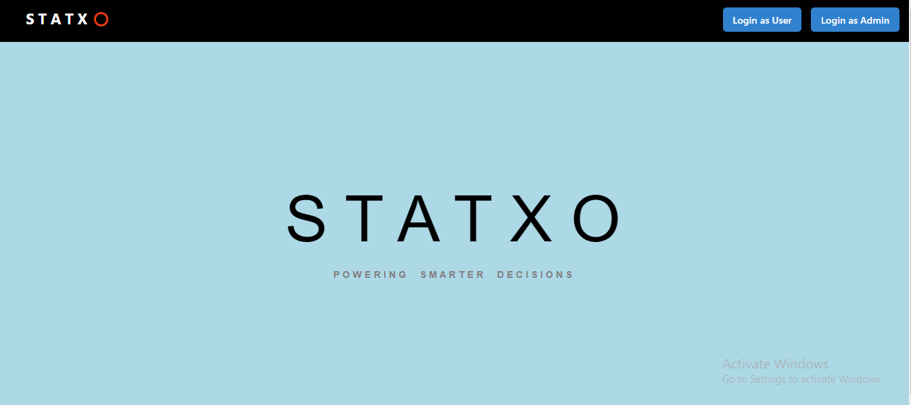
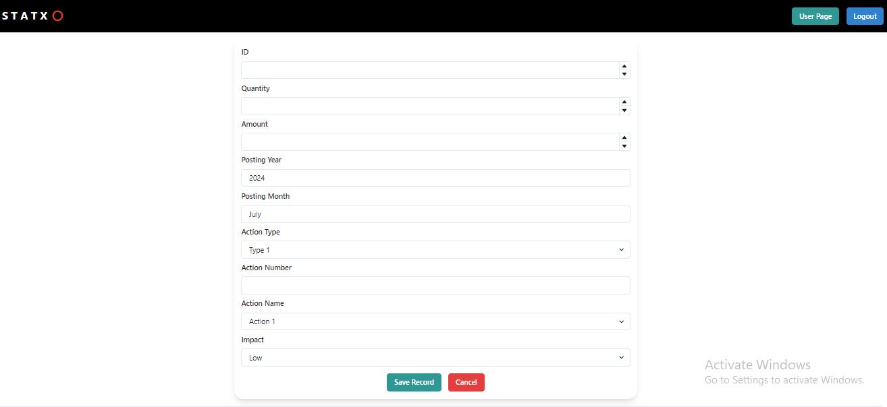
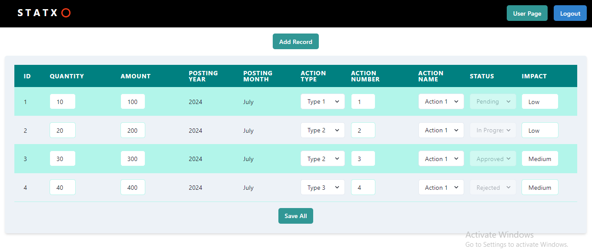

# Statxo 📊

## Introduction
This project is a full-stack web application designed to demonstrate skills in creating backend and frontend solutions. This project involves creating a Node.js backend and a React frontend to manage and display records in a table, with editable fields and login functionalities for users and admins.

### Live Demo
- [Click Here](https://statxo-steel.vercel.app/)

#### Backend Deply Link- https://statxo-013o.onrender.com/
 
## Technology Stack 💻
- **Frontend:**
  - React 
  - Chakra UI
- **Backend:**
  - Node.js
  - Express
  - MongoDB (Database)
- **State Management:**
  - React State Hooks

## Basic UI

#### HomePage



#### AddRecord



#### RecordTable




## Features
### Basic
- **Backend API:** Node.js application to fetch and manipulate data.
- **Frontend Table:** React page to display data in a table format.
  - Editable fields for Amount, ActionName, and ActionType.
  - Select inputs for ActionName and ActionType, numeric input for Amount.
  - Common save button to update multiple rows at once.

### Form
- **Add New Record:** Form to add new records, reflecting changes in both the table and backend.
  - Select inputs for ActionName and ActionType.
  - Automatically set Id, current month, and year.
  - Options for Impact: Low, Mid, High.

### Login
- **Login Page:** Front page with login options for admin and user.
  - **Admin Features:** Editable status field (pending, in progress, approved).
  - **User Features:** Non-editable status field.
  - Buttons for "Login as User" and "Login as Admin" to toggle edit permissions.


## Setup Instructions

To run the project locally, follow these steps:

### Installation

1. **Clone the repository**:
   ```bash
   git clone https://github.com/MayankBelwal05/Statxo.git
   cd your-repository
1. **Install dependencies:**:
   ```bash
   npm install
2. **Running the frontend Server**:
   ```bash
   npm run dev
3. **Running the backend Server**:
   ```bash
   npm run server
### Usage
- Visit the deployed app URL or run the project locally.
- Use the login buttons to toggle between user and admin functionalities.
- Add, edit, and save records using the provided forms and table interface.

### API Endpoints
- GET /api/records: Fetch all records.
- POST /api/records: Add a new record.
- PATCH /api/records/:id: Update an existing record.

Thank You ❤️